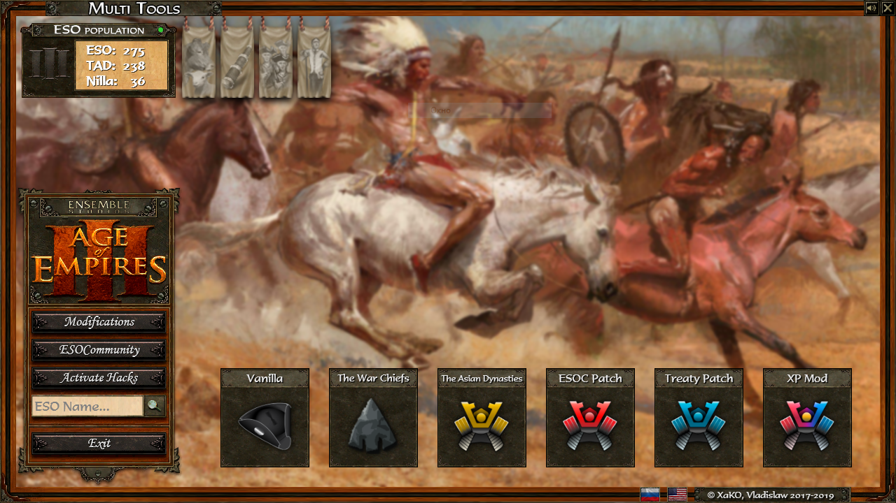
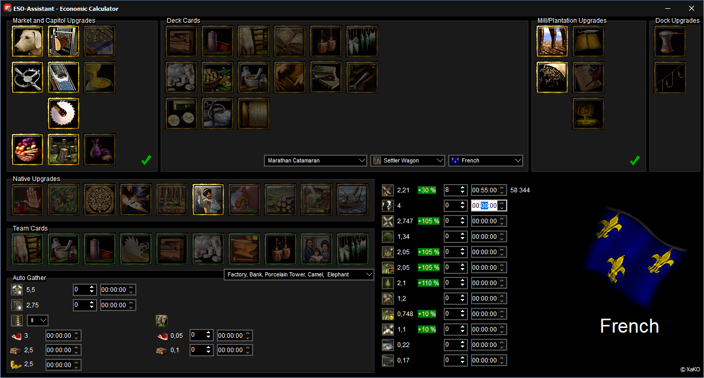
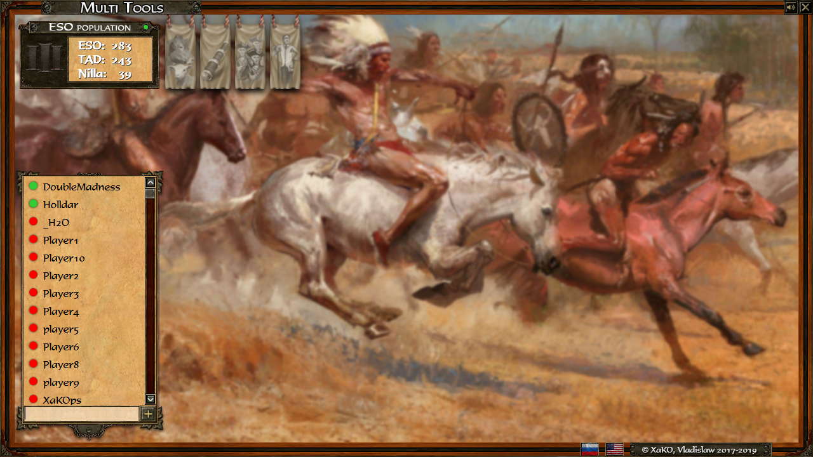
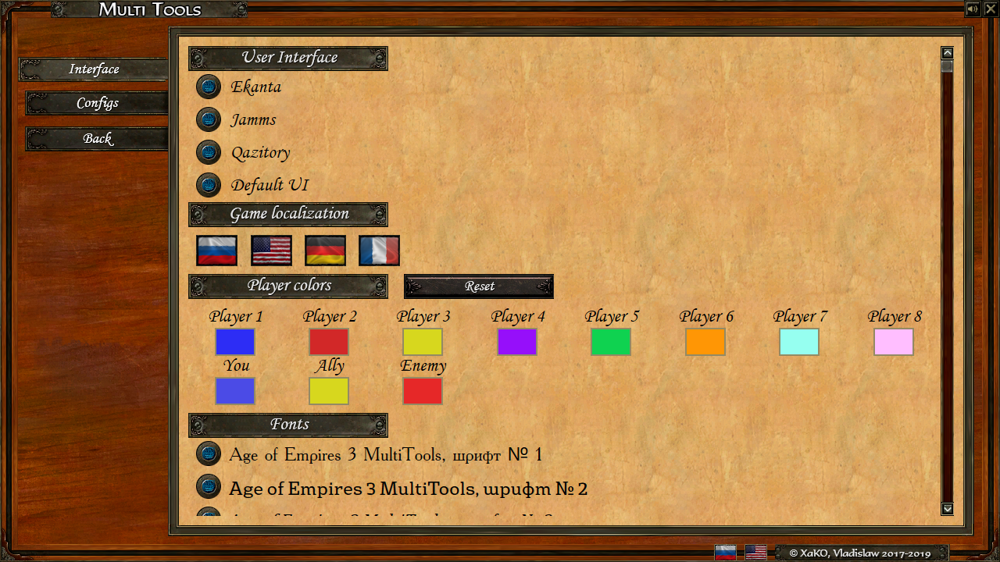
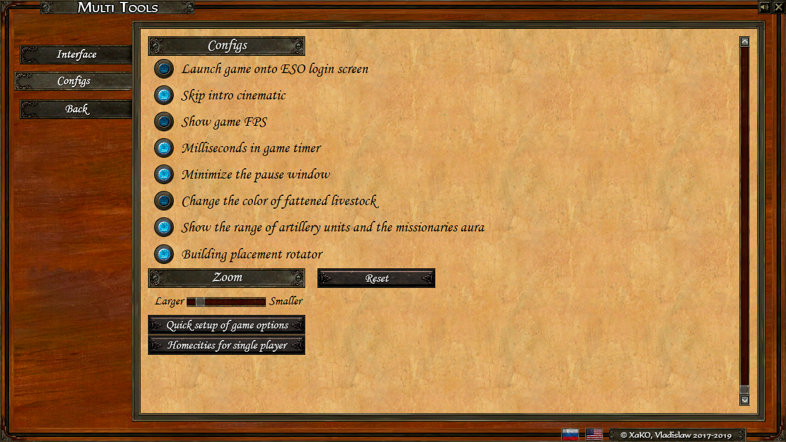

# MultiTools
MultiTools is a **collection of useful tools** for Age of Empires III. Convenience is that all the useful features are collected in one place in combination with a nice interface. The launcher has been integrated into the application to launch all types of games, including the ESOC patch (the patch auto-update function is also present).
App supports both Russian and English localization. View list of all [features](#Features).

## Download

[DOWNLOAD INSTALLER](https://yadi.sk/d/v6NN2wx43BS2Bg)

## Screenshots

## Features

1. Launcher for ESOC Patch, Treaty Patch, XP Mod, Vanilla, TWC and TAD.
2. [ESO Tracker](https://github.com/XaKOps/ESO-Tracker).
3. List of Active Twitch Streams.
4. List of Friends Online.
5. Economic Calculator (You can calculate gather rates for every type of units/buildins for all type of resources for all civilizations in the game with selected DECK CARDS and UPGRADES).
6. ESO population counter.
7. [Modifications](#Modifications).
8. And much more small features!

### Modifications
1. UI switcher (Ekanta, Jamms, Quazitory).
2. Ingame language switcher (Russian, English, Deutsch, French).
3. Custom player colors.
4. Configs (Building placement rotator, skip intro cinematic, show game FPS, show range of artillery and missionaries aura, msecs in timer, color of fattened livestick etc.).
5. Zoom mod.
6. Decks for GameRanger.
7. Quick setup of game options.
8. Fonts changer.

